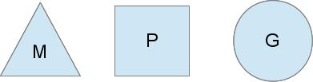

# 协程 goroutine

我们前面介绍过`channel`数据类型，它是传递消息的载体，是并发安全的。Go 语言采用了 CSP 的并发模型，除了`channel`外，`goroutine`也是它的基础。

`goroutine`也叫`Go协程`，协程可以看做是轻量级线程。`Go`拥有强大的系统级线程调度器，来统一调度`goroutine`，调度开销远小于系统级线程调度，使得我们可以非常简单的写出高并发程序。

## 如何使用 goroutine

我们先通过一个简单的例子看`Go`中的协程是怎么用的。

```Go
// 例子1
package main

import (
	"fmt"
	"time"
)

func main() {
	go func() {
		for i := 1; i <= 10; i++ {
			fmt.Print(i, " ")
		}
	}()
	time.Sleep(time.Second)
}
```

通过执行上面的代码，我们可以得到输出：

```
1 2 3 4 5 6 7 8 9 10
```

在`Go`语言使用协程很简单，只需要在函数方法前使用关键字`go`，那么这个函数调用就会变成一个协程。

上面的代码中我们使用了一个匿名函数，函数内容是打印1到10的内容。

> 眼尖的你可能会发现，`go`语句后面跟随了执行了一条睡眠1秒的语句，你可以尝试把它去掉，看看执行效果会是如何。在文章的后面部分，我们会讲到`Go`协程的调度原理和调度过程，明白了之后就会理解为何是这个输出结果。

下面我们来看另外一个例子：

```Go
// 例子2
package main

import (
	"fmt"
	"time"
)

func main() {
	for i := 1; i <= 10; i++ {
		go fmt.Print(i, " ")
	}
	time.Sleep(time.Second)
}
```

`例子2`跟`例子1`不同的是，我们将协程的使用放到`fmt.Print`函数上，从代码可以明显看出，程序的执行将会开启10个协程，分别打印`i`的内容，下面是我调用的一次执行结果：

```
1 3 6 7 5 9 4 10 2 8
```

不知道结果有没有在你的预料之中，这次的输出并不是顺序的1到10，而是乱序的输出，而且每次执行都可能不一样。原因在于协程是并发的执行，在`for`循环中，我们开启了协程，但却无法决定他们的执行顺序，这个是由`Go`运行时调度决定的。

最后是`例子3`：

```Go
// 例子3
package main

import (
	"fmt"
	"time"
)

func main() {
	for i := 1; i <= 10; i++ {
		go func() {
			fmt.Print(i, " ")
		}()
	}
	time.Sleep(time.Second)
}
```

我们把匿名函数放到`for`循环内，传入`i`进行打印。这次，你猜猜结果会是什么，然后动手实验一下。

为了知道和理解上面3个例子的最终行为，我们需要对`Go`语言调度`goroutine`的原理进行了解。

## Goroutine调度器

操作系统为我们提供了系统级线程的操作，我们可以通过它，轻松的创建和销毁线程，让线程去执行我们的命令。

而`Go运行时`不但帮我们管理着系统级线程（自动创建和销毁），而且还在系统级线程之上，建立了用户级线程（goroutine）。

用户级线程无需通过操作系统创建、销毁、调度，所以会快许多并且控制灵活。它通常有三种模型，分别是：

- N:1模型
      多个用户线程运行在一个系统线程，优势在于上下文切换可以非常快速，然而却无法利用多核系统的优势；
- 1:1模型
      一个用户线程运行在一个系统线程，享受多核优势，然而上下文切换带来了额外的开销（核心间切换）；
- M:N模型
      任意用户线程运行在任意系统线程上，不然可以享受多核优势，上下文也可以快速切换。
- `Go`调度器选择的，便是`M:N模型`。

`Go`调度器有三个主要元素：



- M: 代表的是操作系统线程，在`runtime`代码中，它用`M`代表`machine`；
- G: 包含着调度协程需要的信息，包括堆栈、指令指针等等，在`runtime`代码中，它用`G`代表`goroutine`；
- P: 代表调度的上下文，有了它才有了从`N:1`模型到`M:N`的转变，在`runtime`代码中，它用`P`代表`processor`。

概括来说，M 是实际工作的线程，P 持有着一个 G 的队列，负责将 G 和 M 对接，G 到达 M 之后则会被执行。

M、P、G 在很多情况下都不只有一个，Go 调度器会保证程序有足够多的 M 来执行任务。当一个 G 发生阻塞时，P 会脱离开来去到另外一个 M，以确保它持有的 G 队列能被继续执行，当阻塞恢复时，刚才被阻塞的 M 会尝试窃取(`steal`)一个 P 回来以让 G 继续运行，假如获取不到，那么该 G 会被放回全局的队列中等待调度。

> 这个过程让我联想到 work-stealing 算法，有异曲同工之妙。

回到我们上面的问题，在`例子2`中，我们打印出了乱序的结果，是因为在`for`循环中，我们开启了10个协程，而协程是一个并发的过程，取决于`Go`运行时的调度，无法保证协程间的执行是顺序的。

而启用`time.Sleep`，是因为Go程序并不会等待协程的完成，主程序一旦完成，程序便退出，而协程虽然比线程轻量级，也依旧存在开销，主程序执行速度肯定更快，我们上面的例子如果没有加入睡眠操作，那么协程将会得不到运行便退出了。

## 协程 VS 线程

协程相比线程，有着许多的优势：

- 更小的创建/销毁开销；
- 更小的切换开销；
- 更少的内存消耗。

以上的特点让我们的程序可以轻松的创建上万个协程，然而协程并不会比线程运行地更快，只是增加了更多的并发性和灵活性。

我在内存占用上做个了简单测试，运行起下面的代码：

```Go
func waitForTenSeconds() {
        time.Sleep(10 * time.Second)
}

func main() {
        for i := 1; i < 100000; i++ {
                go waitForTenSeconds()
        }
        time.Sleep(60 * time.Second)
}
```

然后进行内存占用查看，会发现，即使启用了10w个`goroutine`，内存也只不过占用了250MB左右，非常之底。

## 总结

我们介绍了`Go并发模型`的又一个基础：协程（goroutine），它是由`Go`运行时自动管理的，具有高并发性、低开销，比线程更灵活。

首先介绍了如何使用`goroutine`，同时简单介绍了`Go`运行时如何调度协程。

协程与通道的结合，才是`Go并发模型CSP`的核心，在后续的文章中将会进行介绍。

## 参考

[The Go scheduler](http://morsmachine.dk/go-scheduler)
